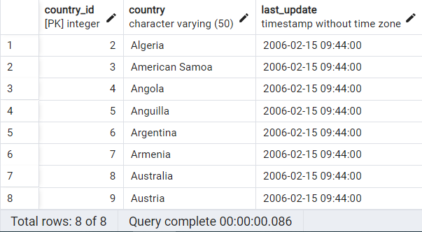
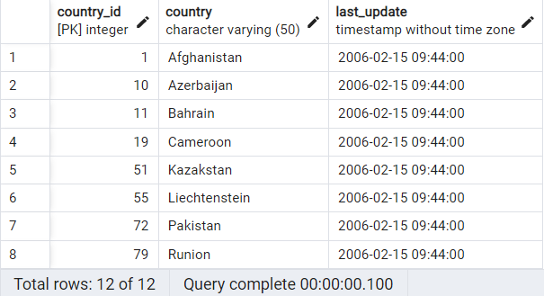
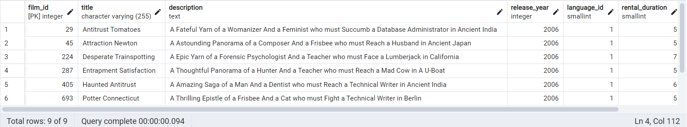
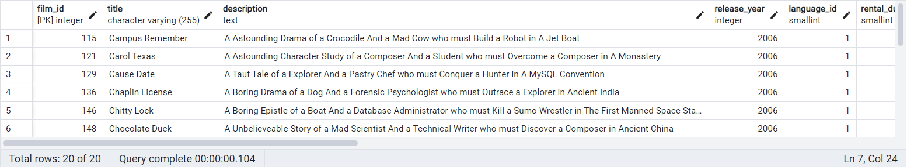

# LIKE & ILIKE
## Perform the following query scenarios on the ***dvdrental*** sample database.

1. List the country names in the ***country*** column of the country table, starting with the 'A' character **AND** ending with the 'a' character.
```sql
SELECT * FROM country
WHERE country LIKE 'A%a';
```


2. List the country names in the ***country*** column of the country table, consisting of at least 6 characters **AND** ending with the 'n' character.
```sql
SELECT * FROM country
WHERE LENGTH(country) >= 6
AND country LIKE '%n';
```


3. In the ***title*** column of the movie table, list the movie names containing at least 4 'T' characters, regardless of upper or lower case letters.
```sql
SELECT * FROM film
WHERE (LENGTH(title) - LENGTH(REPLACE(title, 'T', '')) + LENGTH(title) - LENGTH(REPLACE(title, 't', '')) >= 4);
```


4. From the data in all the columns in the movie table, sort the data that starts with the ***title*** 'C' character, has a length greater than 90 **AND** a rental_rate of 2.99.
```sql
SELECT * FROM film
WHERE title LIKE 'C%'
AND length > 90 AND rental_rate = 2.99;
```

