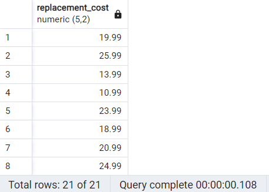
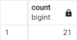
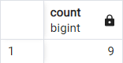
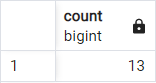
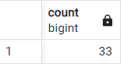

# DISTINCT & COUNT
## Perform the following query scenarios on the ***dvdrental*** sample database.

1. Sort the different values in the ***replacement_cost column*** in the film table.
```sql
SELECT DISTINCT replacement_cost FROM film; 
```


2. How many different data are there in the ***replacement_cost*** column in the film table?
```sql
SELECT COUNT(DISTINCT replacement_cost) FROM film; 
```


3. How many of the ***film*** names in the film table start with the character T **AND** at the same time the rating is equal to 'G'?
```sql
SELECT COUNT(*) FROM film
WHERE title LIKE 'T%'
AND rating = 'G';
```


4. How many of the ***country*** names in the country table consist of 5 characters?
```sql
SELECT COUNT(*) FROM country
WHERE country LIKE '_____'
```


5. How many of the ***city*** names in the city table end with the character 'R' or r?
```sql
SELECT COUNT(*) FROM city
WHERE city ILIKE '%R'
```

