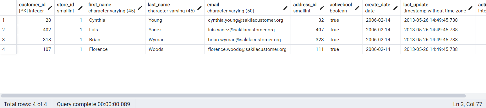

# LIMIT & OFFSET
## Perform the following query scenarios on the ***dvdrental*** sample database.

1. List the 5 longest films in the film table **AND** the film ***title*** ends with the 'n' character.
```sql
SELECT * FROM film
WHERE title LIKE '%n'
ORDER BY length DESC
LIMIT 5;
```


2. List the second 5 shortest films (6,7,8,9,10) in the film table **AND** the film ***title*** ends with the 'n' character.
```sql
SELECT * FROM film
WHERE title LIKE '%n'
ORDER BY length
OFFSET 5 LIMIT 5;
```


3. Sort the first 4 data, provided that ***store_id*** is 1 in the descending order according to the ***last_name*** column in the customer table.
```sql
SELECT * FROM customer
WHERE store_id = 1
ORDER BY last_name DESC
LIMIT 4;
```

