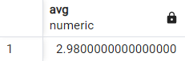
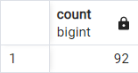
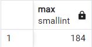
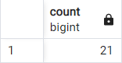

# AGGREGATE FUNCTIONS
## Perform the following query scenarios on the ***dvdrental*** sample database.

1. What is the average of the values in the ***rental_rate*** column in the film table?
```sql
SELECT AVG(rental_rate) FROM film;
```


2. How many of the films in the film table start with the character 'C'?
```sql
SELECT COUNT(*) FROM film
WHERE title LIKE 'C%';
```


3. Among the films in the film table, how many minutes is the longest movie with a ***rental_rate*** equal to 0.99?
```sql
SELECT MAX(length) FROM film
WHERE rental_rate = 0.99;
```


4. How many different ***replacement_cost*** values are there for the films longer than 150 minutes in the film table?
```sql
SELECT COUNT(DISTINCT(replacement_cost)) FROM film WHERE length > 150;
```

