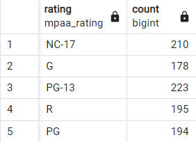
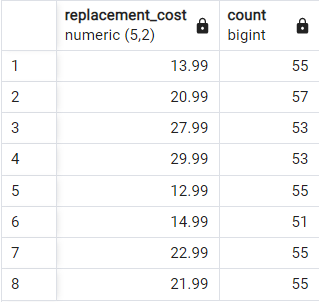
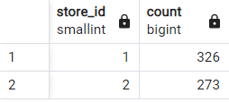

# GROUP BY & HAVING
## Perform the following query scenarios on the ***dvdrental*** sample database.

1. Group the films in the film table according to their ***rating*** values.
```sql
SELECT rating, COUNT(*) FROM film
GROUP BY rating;
```


2. When we group the films in the film table according to the ***replacement_cost*** column, list the ****replacement_cost*** value with more than 50 films and the corresponding number of films.
```sql
SELECT replacement_cost, COUNT(*) FROM film
GROUP BY replacement_cost
HAVING COUNT(*) > 50;
```


3. What are the customer numbers corresponding to the ***store_id*** values in the customer table?
```sql
SELECT store_id, COUNT(*) FROM customer
GROUP BY store_id;
```


4. After grouping the city data in the city table according to the ***country_id column***, find the ***country_id*** information with the highest number of cities and the number of cities.
```sql
SELECT country_id, COUNT(*) FROM city
GROUP BY country_id
ORDER BY COUNT(*) DESC
LIMIT 1;
```

